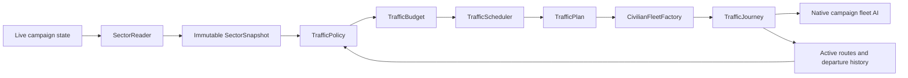

# Architecture

Living Sector separates **observation**, **decisions**, and **execution**. VIP traffic is the first policy. Version 0.2.0 adds an experimental mission/native-route executor alongside the existing direct-fleet path. The latter remains the default for automatic departures; `useNativeRoutes` selects the new executor for future departures, while explicit console tests always use it.

## Nex compatibility constraint

Design for an ordinary installed Nexerelin release. Avoid requiring edits to Nex source/configuration, a custom Nex jar or a maintained fork. Compatibility adapters, workarounds and regression tests belong in Living Sector. Prefer existing APIs, listeners and extension points; when a required hook is unavailable, investigate a local fallback or reduce the feature's scope. Treat any proposal requiring upstream Nex changes as an exceptional dependency to discuss, not an implementation assumption. Integration tests exercise the installed Nex code without modifying it.

## Mission and native-route slice

`TrafficMission` is pure saved intent: stable ID, policy plan, faction, seed, ordered market stops, lifecycle, current stop, physical generation, and bounded event history. It owns completion/identity but not a second simulated position. `NativeMission` holds engine bindings and a condition checkpoint in the campaign layer.

`NativeTraffic` compiles market itineraries into native boarding/travel/visit/docking segments and implements Nex route and fleet listeners. `NativeTrafficAssignmentAI` extends vanilla route assignments, using passive civilian stops and normal native placement/travel. The installed route manager retains control of spawning/despawning. Abstract travel and physical movement share one route; final completion is distinguished from intermediate arrival, destruction, cancellation, and distance despawn.

Admission requires an active `NexRouteManager`. Nex installs this replacement through the `RouteManager` alias in its [XStream configuration](https://github.com/Histidine91/Nexerelin/blob/a669f4d0740e95a4acbb6b894dde09ade67aa754/jars/sources/ExerelinCore/exerelin/plugins/XStreamConfig.java#L216); a freshly generated campaign may require one save/load first. A rejected start explains this prerequisite before creating a mission or registering listeners. Living Sector does not replace the global manager or migrate other mods' routes itself.

`FleetCheckpoint` preserves surviving ship IDs, variants, captains, hull fraction, base CR, mothball/flagship state, and cargo before native distance despawn. It creates new physical fleet containers from those survivors, rather than regenerating lost ships from the original profile. It imports the route's already-updated damage scalar without applying it again. Unreconciled additional abstract damage fails explicitly; a general virtual combat/attrition resolver is outside this slice. Module-specific damage and persistent multi-mission actors are not supported features yet.

Civilian physical fleets carry the trade flag. Their route's `OptionalFleetData.strength` stays null so both checked Nex strategic-strength paths exclude them. This is separate from whether a hostile fleet pursues them.

The existing manager stores the native executor lazily, preserving old saved manager/journey fields. On load it restores one transient Nex listener and reconciles existing fleet listeners; it does not respawn legacy journeys. Native missions share the existing global/per-policy admission accounting, count once across representations, and receive maintenance on the existing cadence. Manual tests bypass probability/cooldowns/duplicate suppression but still occupy global capacity. Recent terminal mission history is capped at 16 records; each mission keeps at most 12 event entries.

`TrafficDebug` and the optional `ls` console command create/inspect trips and inject test-only losses. `DistractionProbe` runs only on explicit request, samples one location with a bounded fleet count, and expires after its requested duration. It never changes target selection. See [the live route procedure](ROUTE_TEST.md).

The [long-run debug recorder](DEBUG_RECORDER_DESIGN.md) is off by default and separate from gameplay history. `TrafficRecorder` attaches transient event sinks to native missions and temporary listeners to direct journeys. `RotatingLog` manages bounded UTF-8 batches and a fixed common-file namespace shared across runs (32 MiB default, configurable from 8–128 MiB). `RecorderState` saves only the branch cursor. On-demand `RecorderReport` queries honor saved ancestor cutoffs and disclose missing history. No history files or LunaLib objects enter the save graph, and disabling the recorder detaches collection.

The following diagram and direct-journey details describe the preserved POC path. Combat operations and non-market itineraries remain future work.



## Components

| Component | Responsibility |
| --- | --- |
| `LivingSectorPlugin` | Load settings, register built-in policies, install exactly one campaign manager. |
| `SectorReader` | Read full snapshots on demand; provide direct endpoint hostility checks for maintenance. |
| `SectorSnapshot` | Immutable input: colony identity, owner, size, stability, location, planet/station status, and diplomacy. |
| `TrafficPolicy` | Calculate a budget from sector state and propose a suitable route and fleet. |
| `TrafficContext` | Expose snapshot, active routes, current simulation day, and per-policy origin cooldown checks. |
| `TrafficBudget` | State-dependent target, variation, departure probability, hard limit, and origin cooldown. |
| `TrafficScheduler` | Maintain target rerolls and successful departure history; apply population limits and probability. |
| `TrafficPlan` | Describe endpoints, fleet name, ship variants, boarding time, and maximum lifetime. |
| `TrafficRegistry` | Register policies by unique ID without changing the manager. |
| `CivilianFleetFactory` | Validate live endpoints and create a normal civilian fleet from a plan. |
| `TrafficJourney` | Monitor route safety, divert when necessary, and retire stale fleets. |
| `TrafficManager` | Run independent planning and maintenance cadences, share capacity fairly, track journeys, expose diagnostics. |

## Add another traffic type

1. Implement `TrafficPolicy` with a unique stable ID, such as `research_transfer`.
2. In `budget(snapshot)`, derive population and frequency from relevant state. Setting the target or daily probability to zero pauses departures for that policy.
3. In `plan(context, random)`, inspect the state, active routes, and cooldowns. Return a `TrafficPlan`, or `null` when there is no suitable trip. Use the supplied RNG for reproducible tests.
4. Register the policy in `LivingSectorPlugin.onApplicationLoad()`:

   ```java
   TrafficRegistry.register(new ResearchTransferPolicy());
   ```

5. Add behavioral tests to `tests/livingsector/TrafficTests.java` and run `python3 build.py test`.

Another mod can register a policy from its own `onApplicationLoad()` using the same registry and a dependency on `living_sector`. Policy registrations live for the application session and must not retain campaign objects or save-specific state.

The shared scheduler currently permits at most one proposal per policy per planning pass (five campaign days by default). Each type has independent target state and origin cooldowns. A daily probability `p` becomes `1 - (1 - p)^intervalDays` for the planning window. This represents at least one opportunity, not the expected count of daily spawns: throughput is limited to one fleet per type per pass. All types compete for the global cap in randomized order. Cooldowns are consumed only after a fleet is successfully placed in the campaign. Duplicate routes are forbidden within a type, in the same direction; simultaneous A→B and B→A trips are allowed.

For algorithms that need additional inputs, extend `SectorSnapshot` and populate them in `SectorReader`. For example, commodity availability, shortages, industry tags, accessibility, or local threat observations can become snapshot fields. Keep live `MarketAPI` and fleet references in `campaign/`, so decisions remain testable without Starsector. The current snapshot intentionally does not contain those future inputs yet.

## Lifecycle and persistence

`TrafficManager` is a persistent `EveryFrameScript`. It stores its RNG, simulation day, scheduler state, tracked journeys, and error retry times. It is installed only if `SectorAPI.hasScript(TrafficManager.class)` is false. The normal game save mechanism serializes that state, and loading does not create another copy.

Policies, registry entries, settings, and sector snapshots are not part of saved campaign state. They are reconstructed at application startup or on demand within an update. There is no snapshot cache spanning updates, so emergency routing never relies on the previous planning pass. Saved journeys hold the fleet reference, traffic ID, endpoint IDs, original expiry time, and diversion/retirement flags. Market IDs are resolved against the current economy, so ownership changes and removed markets are visible.

Do not casually rename persisted classes or fields, especially `TrafficManager`, `TrafficJourney`, `TrafficScheduler`, and its `TypeState`. Add migration or defaults when evolving their saved structure. This is a first prototype, not a promise of save compatibility across arbitrary future schema changes.

Native fleet AI performs departure, jump-point navigation, threat avoidance, and arrival/despawn. There are no custom per-fleet scripts or custom assignment callbacks to serialize. Every two campaign days by default, the journey monitor reads the two live endpoints and checks current relations in both directions. Only if a safe return to the origin is impossible does it request a full snapshot to find another port. A dangerous route returns to its safe origin, or uses the nearest safe port by hyperspace distance if returning is impossible. A diversion does not reset the maximum lifetime.

Destroyed and arrived fleets release capacity on the next maintenance pass; planning also prunes native arrivals before checking the cap. Timeout/no-safe-port cleanup waits while a fleet is visible or fighting. Those waiting fleets continue to count toward capacity. Setting global `enabled` to false stops new departures while maintaining existing journeys.

## Runtime bounds and failures

- No scans while paused. Planning defaults to every five days; maintenance defaults to every two. Both are configurable positive intervals.
- Healthy journeys and return-to-origin diversions use direct market lookups and a few relation checks, without a sector scan. Maintenance cost is proportional to active fleet count and bounded by the fleet cap.
- A snapshot is lazy and shared within the update, so simultaneous diversions and planning perform at most one full scan.
- Disabled spawning, a full global cap, and no ready policies skip planning snapshots. Existing journeys still receive maintenance.
- Diplomacy queries are limited to factions owning eligible ports plus factions of active traffic fleets.
- VIP selection generally scans ports for a weighted origin and destination; the worst case retries every origin when no route is available.
- Both global and per-policy hard limits protect against unbounded spawning. Lowering a limit suppresses departures until existing traffic falls below it; it does not delete healthy fleets.
- A large time step produces one scheduling pass, not a backlog of departures.
- A policy exception is logged and that policy backs off for 30 campaign days; other policies may continue. Journey-management failures are not silently swallowed.

The console status includes planning passes, maintenance passes, sector scans, and last/max update milliseconds. Counters and timings reset on load. Timings cover this manager's due update work, including fleet construction when it spawns; they do not measure native fleet AI or rendering. Use them in a real campaign before attributing frame-time problems to this mod.

The planning deadline retains the original `nextTick` field for save compatibility. A transient initialization flag rebases both deadlines from the saved simulation day on first advance after load, using current settings. This handles old daily deadlines without an immediate catch-up pass. It also means repeatedly reloading postpones the next pass. The headless tests check this initialization behavior, not the game's actual save serializer.

For much larger traffic populations, consider virtual routes that only instantiate fleets near the player. This prototype keeps every active journey as a real campaign fleet and deliberately bounds their count.

## Validation boundary

Decision tests exercise diplomacy, eligibility, cooldowns, changing sector size, fluctuating targets, long-running population bounds, and another policy. Journey tests use proxies implementing the installed game interfaces to exercise diversion and retirement. They do not implement Starsector's navigation, combat, or save serializer. The live test in `TESTING.md` is required before calling a version playable or release-tested.
