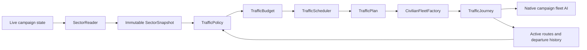

# Architecture

Living Sector separates **observation**, **decisions**, and **execution**. VIP traffic is the first policy using the framework. The current executor handles civilian point-to-point journeys; combat operations or multi-stop itineraries would require another executor or an extension to the journey model.



## Components

| Component | Responsibility |
| --- | --- |
| `LivingSectorPlugin` | Load settings, register built-in policies, install exactly one campaign manager. |
| `SectorReader` | Read eligible live markets and current faction hostility once per campaign day. |
| `SectorSnapshot` | Immutable input: colony identity, owner, size, stability, location, planet/station status, and diplomacy. |
| `TrafficPolicy` | Calculate a budget from sector state and propose a suitable route and fleet. |
| `TrafficContext` | Expose snapshot, active routes, current simulation day, and per-policy origin cooldown checks. |
| `TrafficBudget` | State-dependent target, variation, departure probability, hard limit, and origin cooldown. |
| `TrafficScheduler` | Maintain target rerolls and successful departure history; apply population limits and probability. |
| `TrafficPlan` | Describe endpoints, fleet name, ship variants, boarding time, and maximum lifetime. |
| `TrafficRegistry` | Register policies by unique ID without changing the manager. |
| `CivilianFleetFactory` | Validate live endpoints and create a normal civilian fleet from a plan. |
| `TrafficJourney` | Monitor route safety, divert when necessary, and retire stale fleets. |
| `TrafficManager` | Run one daily update, share global capacity fairly, track journeys, expose diagnostics. |

## Add another traffic type

1. Implement `TrafficPolicy` with a unique stable ID, such as `research_transfer`.
2. In `budget(snapshot)`, derive population and frequency from relevant state. Setting the target or daily probability to zero pauses departures for that policy.
3. In `plan(context, random)`, inspect the state, active routes, and cooldowns. Return a `TrafficPlan`, or `null` when there is no suitable trip. Use the supplied RNG for reproducible tests.
4. Register the policy in `LivingSectorPlugin.onApplicationLoad()`:

   ```java
   TrafficRegistry.register(new ResearchTransferPolicy());
   ```

5. Add behavioral tests to `tests/livingsector/TrafficTests.java` and run `python3 build.py test`.

Another mod can register a policy from its own `onApplicationLoad()` using the same registry and a dependency on `living_sector`. Policy registrations live for the application session and must not retain campaign objects or save-specific state.

The shared scheduler currently permits at most one proposal per policy per campaign day. Each type has independent target state and origin cooldowns. All types compete for the global cap in randomized order. Cooldowns are consumed only after a fleet is successfully placed in the campaign. Duplicate routes are forbidden within a type, in the same direction; simultaneous A→B and B→A trips are allowed.

For algorithms that need additional inputs, extend `SectorSnapshot` and populate them in `SectorReader`. For example, commodity availability, shortages, industry tags, accessibility, or local threat observations can become snapshot fields. Keep live `MarketAPI` and fleet references in `campaign/`, so decisions remain testable without Starsector. The current snapshot intentionally does not contain those future inputs yet.

## Lifecycle and persistence

`TrafficManager` is a persistent `EveryFrameScript`. It stores its RNG, simulation day, scheduler state, tracked journeys, and error retry times. It is installed only if `SectorAPI.hasScript(TrafficManager.class)` is false. The normal game save mechanism serializes that state, and loading does not create another copy.

Policies, registry entries, settings, and sector snapshots are not part of saved campaign state. They are reconstructed at application startup or each observation tick. Saved journeys hold the fleet reference, traffic ID, endpoint IDs, original expiry time, and diversion/retirement flags. Market IDs are resolved against the current economy, so ownership changes and removed markets are visible.

Do not casually rename persisted classes or fields, especially `TrafficManager`, `TrafficJourney`, `TrafficScheduler`, and its `TypeState`. Add migration or defaults when evolving their saved structure. This is a first prototype, not a promise of save compatibility across arbitrary future schema changes.

Native fleet AI performs departure, jump-point navigation, threat avoidance, and arrival/despawn. There are no custom per-fleet scripts or custom assignment callbacks to serialize. Once each day, the journey monitor checks current relations in both directions. A dangerous route returns to its safe origin, or uses the nearest safe port by hyperspace distance if returning is impossible. A diversion does not reset the maximum lifetime.

Destroyed and arrived fleets release capacity on the next daily update. Timeout/no-safe-port cleanup waits while a fleet is visible or fighting. Those waiting fleets continue to count toward capacity. Setting global `enabled` to false stops new departures while maintaining existing journeys.

## Runtime bounds and failures

- No scans while paused. One market snapshot and journey update per campaign day.
- Diplomacy queries are limited to factions owning eligible ports plus factions of active traffic fleets.
- VIP selection generally scans ports for a weighted origin and destination; the worst case retries every origin when no route is available.
- Both global and per-policy hard limits protect against unbounded spawning. Lowering a limit suppresses departures until existing traffic falls below it; it does not delete healthy fleets.
- A large time step produces one scheduling pass, not a backlog of departures.
- A policy exception is logged and that policy backs off for 30 campaign days; other policies may continue. Journey-management failures are not silently swallowed.

For much larger traffic populations, consider virtual routes that only instantiate fleets near the player. This prototype keeps every active journey as a real campaign fleet and deliberately bounds their count.

## Validation boundary

Decision tests exercise diplomacy, eligibility, cooldowns, changing sector size, fluctuating targets, long-running population bounds, and another policy. Journey tests use proxies implementing the installed game interfaces to exercise diversion and retirement. They do not implement Starsector's navigation, combat, or save serializer. The live test in `TESTING.md` is required before calling a version playable or release-tested.
