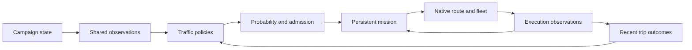

# Living Sector: recommended traffic design

**Status: broader design proposal; implemented slice noted below.** Revised 2026-09-07 after clarification that the original architecture document is an open design sketch. This replaces the earlier, more prescriptive review.

**Implementation update:** the local 0.2.0 development build now contains the first mission/native-route slice, market return itineraries, checkpointing, and diagnostic commands. Its headless checks pass; [live route testing](ROUTE_TEST.md) is pending. The broader design below remains a proposal.

The goal is a sector that feels alive through varied, believable traffic whose decisions respond to game state. The original document's mechanisms, tier counts, numerical budgets, and population examples are options, not requirements.

**Visibility clarification:** preserve Starsector/Nex's normal fleet spawning and despawning behavior. Living Sector does not need a stronger promise that fleets can never appear or disappear within player observation under every circumstance.

The original `living_sector_traffic_architecture_idea_revised (1).md` remains unchanged in Downloads. [ARCHITECTURE.md](ARCHITECTURE.md) describes the current implementation; this document records design direction and later options.

## 1. Recommendation

Build a **mission-based traffic director using native routes**, with aggregate demand for potential trips.

The pieces are:

1. A small shared picture of relevant world state.
2. Traffic policies that decide whether a trip makes sense.
3. Admission rules that keep traffic and processing bounded.
4. Persistent missions describing approved trips and their itineraries.
5. A native execution adapter that runs those trips through the existing route/fleet machinery.
6. Modest outcome history that future policies can use.

Potential traffic does not need an individual simulated actor. A port can have passenger interest, research opportunities, or evacuation pressure without us creating hundreds of invisible passengers, plotting each one's location, or scheduling individual thinking.

Create an individual mission when a trip is admitted. Once created, it has a real identity and a native route, including while that route has no physical fleet. Native routes already provide an abstraction layer; a second independently moving conceptual layer is an optional later feature.

This gives us useful traffic sooner and concentrates custom logic on why ships travel and how trips respond to events. It deliberately leaves a universal encounter simulator, a full ship economy, and a general real-time scheduling framework outside the first expansion.

## 2. Working defaults

These are recommended starting choices, open to revision as features are tested.

| Concern | Starting choice |
| --- | --- |
| Endpoints | Inhabited planets and stations are equivalent port candidates. |
| Population | Probabilistic opportunities, mild selection weights, and limits that suppress departures. Spare capacity does not create demand. |
| State-dependent behavior | Policies can change frequency, origin/destination preference, itinerary, and fleet profile from observed conditions. |
| Visibility | Use the route manager's ordinary materialization and retention behavior. |
| Dependencies | Target the installed Nex setup. Accept a Nex dependency when using its hooks; avoid maintaining two integration backends without a reason. |
| Nex maintenance | Prefer compatibility with ordinary Nex releases. Keep adapters and fixes in Living Sector; avoid requiring Nex source/config edits, replacement jars or a maintained fork. |
| Economic effects | Begin with traffic and recorded trip outcomes. Actual resource/population transfers become explicit features when needed. |
| Persistence | Save admitted missions and their necessary execution state; discard or rebuild derived caches. |
| Scale | Measure admitted routes and real fleets before selecting larger defaults. Individual conceptual actor counts are not a success metric. |

The existing POC is already a framework: policies, immutable decision input, admission logic, native fleet execution, diagnostics, and tests exist. Extend those useful boundaries. Its current physical journeys have been tested for station arrival/despawn and save/reload; native route integration has not yet been demonstrated.

## 3. The main loop



Policies run occasionally on campaign-time schedules. A policy reads a shared view, makes a bounded search for a sensible trip, and can decline to propose anything. Admission rechecks important live conditions and available capacity before committing.

For an admitted mission, the execution adapter sets up the itinerary and lets native route/fleet code perform travel. Living Sector responds to leg completion, relevant world changes, and terminal events. It does not independently advance a second position alongside an active native executor.

Ordinary maintenance reconciles missed events and stale bindings in small batches. No full-sector fleet index is needed for the initial traffic types.

## 4. Demand: summarize possibilities, persist actual trips

Begin with the current VIP probability and selection behavior. There is no need to replace working population math just to introduce missions.

For later policies, think in terms of:

```text
opportunity rate =
    baseline for this traffic type
    × relevant local conditions
    × suppression from existing activity
```

Examples of possible policy behavior:

- Tourism becomes more likely around stable, attractive destinations and less likely when danger is reported.
- Research traffic prefers appropriate sites and originates from suitable ports.
- Evacuation traffic becomes more likely around conflict, then chooses reachable welcoming ports.
- Relief traffic considers distress and source capacity; actual commodity transfers require an explicit economic feature.

Keep frequency and destination preference separate. A world-state change may affect either or both. Treat hostile endpoints as a rejection for ordinary VIP traffic; another future policy may deliberately have different travel rules.

There is no need to store a value for every possible port pair. Start with per-policy/per-port inputs and bounded destination sampling. Add corridor history only for routes that actually produce useful evidence, with expiry and a size limit.

An optional future rate model is `P(at least one opportunity in Δ days) = 1 - exp(-λΔ)`, where λ is opportunities per campaign day. That formula alone does not determine how many departures to issue. The current one-proposal-per-pass behavior should stay explicit until throughput is deliberately changed.

Rejected optional demand normally expires. It must not accumulate into a giant departure burst once capacity becomes free. Save individual outstanding requests only when their identity matters, such as a named charter or contract.

## 5. Missions and extension points

A mission is one approved trip, potentially with multiple stops and a return leg. A continuing ship or organization spanning many missions is a separate feature to add if gameplay needs it.

A compact initial record needs:

```text
schemaVersion, missionId, policyId
factionId, fleetProfileId, generationSeed
itinerary, currentLeg, lifecycle
createdAt, nextReviewAt, revision
nativeBinding, conditionCheckpoint, terminalOutcome
```

The precise fields should follow the route experiment. Avoid saving two independently writable copies of native position, route progress, or damage.

Three extension points are enough initially:

| Extension | Responsibility |
| --- | --- |
| Traffic policy | Decide why a trip should happen and propose its itinerary/profile from game state. |
| Fleet profile | Describe or construct the appropriate ships, capabilities, and civilian/military role. |
| Mission execution | Translate supported itinerary actions into native travel, visits, returns, and completion. |

Start with market, entity, and location/coordinate target references. Stations and planets usually resolve through markets; a research or sightseeing stop may resolve to an entity or safe waypoint. Each leg carries its arrival/visit behavior and fallback.

Implement these as a small concrete model and one native executor. Extract a general target-resolver or executor registry when a second implementation needs it. JSON suits tuning and fleet/profile data; Java suits decision algorithms and engine integration.

A second traffic type should be a new policy and profile using shared itinerary behavior. If it requires more special cases inside `TrafficManager`, the separation needs work.

## 6. Execution and visibility: use the native lifecycle

The active Starsector/Nex route manager should decide when a route gets a physical fleet and when that representation retires. Living Sector supplies its own route data, fleet construction, assignments, and mission callbacks through supported extension points.

The desired behavior is ordinary native behavior with our traffic added. We do not need custom sensor envelopes, player-distance promotion queues, extra visibility pinning, or our own teleport/`reveal` guarantees. Do not replace the global manager or change its shared thresholds to accommodate this mod.

Control load primarily by admitting a bounded number of missions/routes and choosing reasonably small fleet profiles. Track physical fleet counts as useful telemetry and a reason to slow new departures. Do not delete a healthy fleet or refuse a native spawn solely to meet a separate physical quota.

The checked Nex spawner expires a route when fleet creation returns null. That is a failure path to handle, not a generic “defer this spawn until another frame” mechanism. See the source notes below.

Native ownership does not remove the need for correct integration:

- A mission and its route/physical fleet represent one logical trip.
- Physical fleet movement and battle results are authoritative while that fleet exists.
- Distance despawn changes representation; arrival, destruction, and cancellation have different mission outcomes.
- Intermediate arrival advances the itinerary; it does not complete a return journey.
- A missing binding requires reconciliation before creating a replacement.
- Late or duplicate events cannot revive a terminal mission or apply losses twice.

The current POC's final `GO_TO_LOCATION_AND_DESPAWN` assignment cannot simply serve as every intermediate leg of a native route itinerary. Test the route assignment lifecycle before generalizing it.

### Ship condition

Use the native route's damage model as an integration starting point, then establish what our spawner must preserve. Aggregate damage is not an exact roster.

**Updated civilian persistence decision:** ordinary civilian missions now keep an aggregate fleet-point budget and regenerate ships at native materialization. Exact survivor identity, loadout, hull/CR, captains and cargo are not requirements. Physical casualties and abstract route losses must reduce the budget once; generation must not reset the allowance. See [aggregate damage](OFFSCREEN_DAMAGE.md) and [scaling](SCALING.md).
For named or player-interacted ships, stronger identity persistence may be justified. If the chosen adapter cannot preserve a needed feature, defer that feature or use a supported execution path that can; do not silently pretend it works.

## 7. Performance: start with bounded, occasional work

Retain the current idea of separate planning and maintenance cadences. Daily versus five-day polling is less important than what a pass does: two endpoint lookups are cheap work; searching every market pair is a different problem.

The first scheduler expansion should be modest:

1. Track the next planning time per policy, staggered so all types need not run together.
2. Reuse a shared observation snapshot across related planning work.
3. Limit candidate attempts and trips admitted in one update.
4. Process maintenance through a saved cursor or due queue as active mission counts grow.
5. React cheaply to native events and retain a periodic reconciliation fallback.

A bounded search may occasionally find no candidate despite one existing. For optional ambient traffic that is acceptable; allow another attempt later. Do not trade a small chance of no departure for an unbounded search.

Use explicit observation freshness. Cheap preferences may tolerate older data; recheck endpoint existence, ownership/access, and other critical conditions immediately before committing a trip or arrival. Event invalidation can improve responsiveness, with periodic refresh covering missed changes.

A time budget can stop starting more Living Sector work, but it cannot interrupt an engine call already executing. Native route scans, fleet creation, and fleet AI also consume time outside our planner. Measure those effects through whole-campaign performance, not just the manager's stopwatch.

If queues later become necessary, store tasks as data, deduplicate by owner/revision, and give maintenance and planning bounded service. A complex priority/deadline scheduler should solve measured contention, not precede it.

When overloaded, stop accepting optional trips and let existing missions settle. Skip expired departure opportunities after a large time jump; do not replay every missed planning tick.

## 8. Consequences and offscreen behavior

Start with outcomes the active executor can actually establish: arrival, diversion, cancellation, destruction, and observed damage. Aggregate them into small recent-history records that policies can use.

This already supports useful feedback: repeated observed losses can suppress ordinary passenger demand or change destination preference. Count each trip/outcome once. Use elapsed-time decay, bounded history, and confidence; missing observations do not prove a corridor safe.

Initially, offscreen movement and any applicable native resolution follow the route integration's supported behavior. Route registration alone does not promise every possible pirate/civilian encounter will be resolved. This is a known fidelity limit to test and document.

A universal combat or encounter broker is not required to add responsive traffic. If believable offscreen piracy later becomes an important missing behavior, implement one explicit integration or a clearly scoped statistical model for our own traffic. Establish who owns each outcome before mutating anything.

Native systems retain ownership of external fleets, faction military strength, and economic resources. Import losses already applied by native code instead of applying them again. Do not fabricate specific external battle victories or materialize another mod's actor as a duplicate.

For civilians, verify both physical trade flags and abstract strategic-strength handling. For a future military policy, define deliberate strategic participation separately.

### Civilian traffic can distract military fleets

Ambient traffic can affect wars simply by becoming something hostile fleets pursue, even when it contributes no strategic strength or economic resources. A sector-wide population limit does not prevent a troublesome concentration in one contested system.

The installed campaign AI exposes priority-target controls, and native assignments can discourage detours. Nex deliberately makes its post-invasion wait stage non-aggressive so those fleets remain near the planet. These mechanisms do not establish a universal rule that military fleets ignore civilian targets. [Nex invasion stages](https://github.com/Histidine91/Nexerelin/blob/a669f4d0740e95a4acbb6b894dde09ade67aa754/jars/sources/ExerelinCore/exerelin/campaign/intel/invasion/InvasionIntel.java#L120)

Inspection of the installed 0.98a-RC8 tactical module's bytecode confirms that its ordinary hostility check can fall through to faction hostility for a trade fleet; the trade classification is not a blanket wartime exemption. Whether an eligible target is actually pursued is a separate decision. The POC's `MEMORY_KEY_FLEET_DO_NOT_GET_SIDETRACKED` flag controls the shuttle's own behavior, not enemy pursuit. No campaign experiment has yet measured the resulting distraction.

Before raising density, compare equivalent scenarios with no Living Sector traffic, ordinary traffic, and elevated traffic. Include a hostile patrol, an invasion fleet travelling/on-station, and pirates. Record time spent targeting our civilians, pursuit duration, departures from the assigned area, and operation completion time. Use repeated comparable runs; normal AI variation matters.

Start mitigation with local admission limits and reduced or delayed ordinary civilian departures into known active conflict. Existing trips still follow their tested native lifecycle and recovery rules. Faster shuttles alone are not a proven remedy: an unsuccessful chase could last longer. If excessive distraction remains, investigate a narrowly scoped targeting integration before changing external military AI or applying broad ignore flags that could also suppress intended pirate encounters.

### Preferred future direction: civilian targeting policy with real factions

Keep civilian fleets affiliated with their actual carrier faction. Treat how an enemy regards those civilians as a separate wartime policy, initially with two modes:

| Mode | Intended treatment |
| --- | --- |
| Limited war | Military fleets generally leave ordinary civilian traffic alone and prioritize their operation or military targets. Any exceptions must be explicit; this is not universal immunity. |
| Total war | Enemy civilians are eligible for normal hostile targeting. Existing tactical priorities, risk assessment, and operation assignments still decide whether pursuing them makes sense. |

Model the policy per ordered faction pair: faction A's treatment of faction B's civilians can differ from B's treatment of A's. Fleet faction IDs remain real and consistent between abstract routes and physical fleets; a mission classification identifies civilian traffic without changing diplomacy. Initially scope any integration to Living Sector traffic. Do not silently change vanilla or other mods' fleets.

Separate the policy decision from its enforcement in campaign AI. The two-mode design does not establish that the installed AI exposes a suitable selective targeting hook; that still needs a small experiment. Avoid implementing limited war by repeatedly clearing external fleets' assignments, overriding priority targets, or changing faction-wide relationships. Pirate predation needs a separate rule so limited military war does not automatically protect civilians from pirates.

This experiment should work through existing extension points from Living Sector. If selective targeting would require patching Nex, investigate local traffic controls or the carrier-affiliation fallbacks below before making that an upstream dependency.

Later, war severity can select the mode. Start eventual testing with a manual override; add automatic escalation only after both modes work. Use cached or event-driven state, different escalation/de-escalation thresholds, and a minimum time in a mode to avoid frequent scans and rapid switching. A change in mode must also have an explicit, tested rule for pursuits already underway. Any future offscreen interception model should consult the same policy, without changing Nex's strategic-strength exclusion for our civilians.

This is a future design direction. The 0.2.0 route experiment retains current faction hostility and targeting behavior so we can measure a baseline first.

### Carrier affiliation as a fallback or distinct traffic type

The commissioning port/faction and the actual carrier need not be the same. An Independent commercial operator can transport passengers originating from a faction at war. A future affiliation policy should select this at admission and keep it consistent on both native route and physical fleet; changing only the displayed name would not change hostility. Keep sponsor/origin metadata separately for future passenger, reputation, and mission logic.

| Option | Benefit | Tradeoff |
| --- | --- | --- |
| Origin-faction carrier (current test baseline) | Direct faction identity and ordinary wartime vulnerability | Can attract the origin faction's military enemies |
| Independent carrier | Uses an existing faction/relationship model; avoids inheriting every sponsor war | Independent relations still matter, including player reputation and modded hostility; this does not grant immunity |
| Dedicated civilian proxy faction | Allows a deliberate carrier relationship policy separate from sponsors | Requires explicit initialization/update rules, player reputation handling, and Nex diplomacy/strategic exclusion; hidden display alone does not provide those behaviors |

**Local Roider Union 2.2.6 evidence:** `src/roiderUnion/fleets/mining/RoiderMiningRouteManager.kt`, `pickFaction`, includes compatible Independents among carrier choices. `src/roiderUnion/fleets/nomads/NomadTradeRouteManager.kt`, `addRouteFleetIfPossible`, sometimes selects an Independent route faction when both ports permit it, and also selects it for smuggling. These are concrete precedents for carrier affiliation differing from port ownership, not proof that all military distraction is eliminated.

Roider's hidden `roider_bulk` faction is used in `FleetsHelper.getStandardFactionParams` as an additional ship-generation pool. The inspected uses do not establish it as a neutral diplomatic cover for the finished fleet. The legacy `scripts/campaign/Roider_IndieRepMatcher.kt` mirrors the player's Independent relationship onto Roider; its presence alone does not establish that it is active in the current version.

The preferred direction is real carrier factions with the civilian targeting policy above. Independent carriers remain useful for traffic that is actually operated by Independents, or as a fallback if selective targeting proves impractical. A proxy faction is a further fallback with additional diplomacy costs. Carrier affiliation remains unchanged in the 0.2.0 baseline so its initial measurements are comparable with the existing origin-faction VIPs.

## 9. Growth path: add complexity when a feature earns it

| Observed need | Appropriate next addition |
| --- | --- |
| More traffic types with similar travel | Additional policies and profiles |
| Trips with visits or returns | Shared itinerary actions and recovery rules |
| Decisions need richer state | A few new snapshot fields and their freshness rules |
| Periodic work causes measurable spikes | Bounded cursors, resumable searches, and then a work queue |
| High active-route counts are demonstrably expensive | Revisit representation density or conceptual transit |
| A persistent named ship spans trips | Actor identity separate from mission identity |
| Offscreen interceptions matter to gameplay | A narrow encounter/owner integration with explicit tests |
| Military pursuit of civilians measurably disrupts operations | Test selective civilian targeting with limited-war and total-war modes; add severity-driven switching later |
| Relief or evacuation should change the economy | Resource reservations, transfers, and idempotent accounting |
| Multiple policies share sophisticated analysis | Extract that analysis into a reusable service |

The tradeoff is deliberate: aggregate potential demand cannot reconstruct the exact history of every traveler who never became an admitted mission. That fidelity currently has no demonstrated gameplay use. We retain a path to individual conceptual actors if a later feature needs them.

## 10. Implementation plan

| Step | Deliverable | What it proves |
| --- | --- | --- |
| 1. Native route experiment | One existing VIP trip using the installed route manager, a small spawner, and lifecycle diagnostics | Movement, distance despawn/reappearance, civilian strength handling, damage behavior, save/reload, and no duplicate trip |
| 2. Mission slice | A persistent mission record and shared itinerary execution; old physical journeys can finish through their existing executor | Safe evolution of the POC and correct leg/completion ownership |
| 3. Second traffic type | A research/sightseeing trip from a planet or station to a safe site, visit, then return | The framework supports more than renaming VIP traffic |
| 4. State-responsive policy | One meaningful condition changes demand or destination preference, with rejection reasons in diagnostics | Algorithms can depend on world state without engine calls leaking into decision tests |
| 5. Profile and refine | Representative campaign measurements, including military distraction; improve batching/caches and local admission where evidence identifies problems | Useful default traffic levels without excessive processing or disruption of native operations |
| 6. Expand selectively | More policies, richer consequences, or a demonstrated missing offscreen interaction | Additional complexity has a gameplay purpose |

Step 1 is a small integration experiment, not a commitment to replace the current working executor. If the route contract is unsuitable, its findings should shape the next design before the mission model hardens around it.

Include a development command/scenario runner with the first route experiment. It should create a recognizable test trip and expose mission ID, route binding, fleet ID, leg, state, and outcome. This reduces repetitive manual setup.

The next useful in-game milestone is **two noticeably different traffic types sharing one tested lifecycle**, including one round trip.

## 11. Validation and save evolution

Keep existing behavior tests. New tests should cover:

- Policy decisions from controlled world state, including inhabited stations and no suitable trip.
- Bounded candidate attempts, capacity release, and no forced replenishment.
- Itinerary arrival/visit/return/fallback behavior.
- Duplicate callbacks, distance despawn versus destruction, and terminal-state stability.
- Damage import and civilian strategic-strength behavior at the actual adapter boundary.
- Military distraction in comparable live scenarios before increasing traffic density; priority-target mocks cannot establish actual native pursuit choices.
- Save/load and migration in game; mocks do not prove native serialization or callback ordering.

Preserve persisted POC classes while adopting the new model. Let existing physical trips finish unchanged if attaching them to a native route is uncertain. New mission records should have schema versions and stable IDs; rebuild runtime caches on load.

For performance, separate port count, admitted mission/route count, physical fleet count, and due work. Measure whole-frame behavior, allocation/save growth, and planner latency. Thousands of inert records can be a useful stress input later; passing that test does not establish that thousands of native routes are cheap.

A native visibility regression test compares equivalent native and Living Sector route behavior during ordinary approach/departure and relevant Nex operations. It verifies that our integration has not worsened those mechanics; it does not demand stronger visibility guarantees from the engine.

## 12. Source observations retained from the review

These are source observations, not proven integration guarantees. The local Nex route manager and WarSim source files are byte-identical to upstream commit `a669f4d0740e95a4acbb6b894dde09ade67aa754`, checked during this review. Other bundled or compiled files have not been claimed byte-identical.

| Observation | Consequence for the design |
| --- | --- |
| The installed Starsector `RouteManager.advance()` advances routes and invokes spawn/despawn scanning; the Nex override iterates a copy of its route collection. | Keeping many native routes still has recurring cost outside our scheduler. Bound and measure routes, not only physical fleets. |
| Nex exposes route/fleet mapping and lifecycle listeners. Its battle callback accumulates an FP-loss fraction into route damage. | Useful integration hooks exist, but they do not constitute a full persistent ship roster. [Route manager](https://github.com/Histidine91/Nexerelin/blob/a669f4d0740e95a4acbb6b894dde09ade67aa754/jars/sources/ExerelinCore/exerelin/campaign/fleets/NexRouteManager.kt) |
| `NexWarSimScript.getFactionStrengthReport()` excludes physical trade/smuggler fleets but independently admits matching routes with non-null `extra.strength`. Another strength query treats null strength as zero through vanilla `OptionalFleetData`. | Civilian routes should provisionally leave strategic strength null, while live fleets keep appropriate civilian flags. Test both queries and both representations; zero is not equivalent to absence in every path. [WarSim strength reporting](https://github.com/Histidine91/Nexerelin/blob/a669f4d0740e95a4acbb6b894dde09ade67aa754/jars/sources/ExerelinCore/exerelin/campaign/battle/NexWarSimScript.java#L347) |
| WarSim changes route damage and notifies listeners; it is invoked by operations rather than being an automatic pairwise encounter service. | Observe existing operation outcomes. Do not assume registering a route enables civilian interceptions. [WarSim entry point](https://github.com/Histidine91/Nexerelin/blob/a669f4d0740e95a4acbb6b894dde09ade67aa754/jars/sources/ExerelinCore/exerelin/campaign/battle/NexWarSimScript.java#L47) |
| `InvActionStage` considers player spawn range and action fleets before invoking its invasion-specific autoresolution. | This is evidence of an existing representation boundary, not a reusable civilian trip resolver. [Invasion action stage](https://github.com/Histidine91/Nexerelin/blob/a669f4d0740e95a4acbb6b894dde09ade67aa754/jars/sources/ExerelinCore/exerelin/campaign/intel/invasion/InvActionStage.java#L174) |

The supplied vanilla `OptionalFleetData.damage` comment explicitly assigns damage use to the spawner. Verify how our chosen spawner converts damage into actual survivors; propagation is not automatically exact.

One narrow source audit item: the checked Nex battle callback calls `extra.damage.coerceAtMost(1f)` without assigning the returned value. Do not assume that expression clamps the stored field. Cover repeated-damage input in adapter tests; this is not evidence of a crash in the user's campaign. [Relevant callback](https://github.com/Histidine91/Nexerelin/blob/a669f4d0740e95a4acbb6b894dde09ade67aa754/jars/sources/ExerelinCore/exerelin/campaign/fleets/NexRouteManager.kt#L241)
